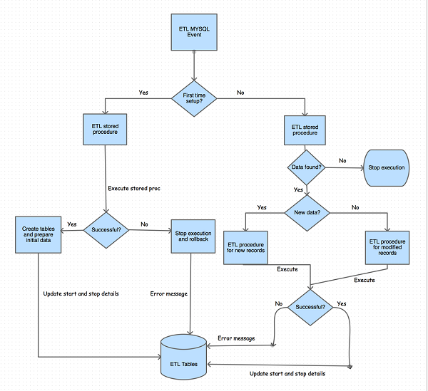

# KenyaEMR Extract-Transform-Load (ETL) Repository
This repository houses the KenyaEMR Extract Transform Load (ETL) scripts that run locally as stored SQL procedures.

**ETL Concept**  
This involves transforming the OpenMRS EAV data model into numerous conventional/flat tables that meet the reporting needs of the system.

The ETL solution for KenyaEMR is based on major encounter types. That is, every major encounter type (_HIV enrollment, HIV
followup etc._) in the system has an ETL table and this provides all encounter information as a single row in the table. ETL tables are created and populated with initial data in the EAV database and incrementally updated with new inserts and updates to the data warehouse in the ETL database.

**Database and Tables**  
KenyaEMR ETL uses a separate database named **_kenyaemr_etl._** The database has a set of flat tables covering various program
categories as shown below.

| **Category** | **Table Name** |
| --- | ---|
| Patient Demographics | etl_patient_demographics |
| Patient Management | <span>etl_patient_program_discontinuation<br />etl_patients_booked_today<br />etl_missed_appointments</span> |
| Maternal and Child Health (MCH) | <span>etl_mch_enrollment<br />etl_mch_antenatal_visit<br />etl_mch_postnatal_visit<br />etl_mchs_delivery</span> |
| HIV | <span>etl_hiv_enrollment<br />etl_patient_hiv_followup</span> |
| HIV Exposed Infant (HEI) | <span>etl_hei_enrollment<br />etl_hei_follow_up_visit</span> |
| TB | <span>etl_tb_enrollment<br />etl_tb_follow_up_visit<br />etl_tb_screening</span> |
| Drugs | <span>etl_pharmacy_extract<br />etl_patient_treatment_event<br />etl_drug_event</span> |
| Laboratory | etl_laboratory_extract |

By design, all ETL table names begin with ‘_etl_’ for consistency and easy identification from main tables in openmrs database. A single stored procedure is used to create the ETL database and its tables. 

KenyaEMR ETL extracts data from the following source tables:

- Obs 
- Encounter 
- Visit 
- Person
- Patient
- Person Attributes
- Orders
- Drug Orders

KenyaEMR ETL uses a set of SQL scripts to extract, transform and load data from the EAV model
into ETL tables. These include a set of stored procedures and MySQL event.

A **mapping document** (provided in the etl design stage) was used to map and transform data from the EAV model into conventional/flat tables. The scripts are as described below:

**DDL**  
This has queries which creates the etl database and its tables. It is the first script to run when implementing the solution. 

**DML**  
This has queries which populate the etl tables with _initial_ data. This is data that already exists in the EAV data model at the point of implementing the solution. The DML script fetches data in EAV model, transforms it and loads it into the corresponding ETL tables.

When benchmarking, the duration of the DML script varies depending on the size of data in the EAV data model. That is, a small database takes a few seconds whereas a big one can take up to 30 minutes. This script is only run once.

**Scheduled_Updates**  
This script takes care of incremental updates of the etl tables. It periodically checks for new records or updates to existing records in EAV model and pushes them to ETL tables. This makes sure that at any given point the ETL database is at par with the EAV counterpart. This script is scheduled to run every 5 minutes. Due to this, it does not introduce a heavy load on the system.

**Extension**  
These scripts can be extended to meet the needs of any implementation. All you have to do is update the DDL, DML and Scheduled_updates scripts.

## Source Data Extraction, Transformation and Loading

**Initial Creation and population of ETL tables**  
Initial creation and population of ETL tables is taken care of by DDL and DML scripts.

**Setup and Configuration**

Software Requirements:

- MySQL Server 5.5
- Mysql server client such as MySQLWorkbench
- Text editor i.e notepad, gedit etc. 

Steps:

1. Locate DDL, DML and Scheduled_Updates SQL scripts.  
2. Open DDL, DML and Scheduled_Updates scripts using your favorite text editor  
3. Open your mysql client program (_we will use workbench)_
4. Connect to openmrs database. In mysql client program, type statement without quotes ```use openmrs;``` and execute it.  
5. Open a new tab in workbench and paste the content of DDL script. Execute and wait to complete.  
6. Open another tab in workbench and paste the content of DML script. Execute and wait to complete. This may take varied time depending of the size of the database. 

**Incremental Updates**  
This is aimed at updating ETL tables with new records or updates of records in EAV data model. Incremental Updates are handled by the Scheduled_Updates SQL script. 

The process uses MySQL event and a set of stored procedures to extract, transform and load data into the ETL tables. The process is as shown below.

**Setup and Configuration**

Steps:

1.   Locate Scheduled_Updates SQL script.  
2.   Open Scheduled_Updates script using your favorite text editor  
3.   Open your mysql client program (_we will use workbench)_  
4.   Open another tab in workbench and paste the content of the Scheduled_Updates script. Execute and wait to complete. This should take a few seconds to complete.

To turn on mysql events scheduler, open a new tab in workbench and execute:


```SET GLOBAL EVENT_SCHEDULER=ON;```

Event scheduler is on if the results of ```show processlist;``` command on workbench has an entry with the following information:  
```
**User**: event_scheduler  
**Command**: Daemon  
**State**: Waiting for next activation
```
**Data integrity and Exception handling**

All scripts are configured to run within a transaction. This means that if an error occurs during execution, there will be a total rollback and execution of the script will stop. The error will be logged in _etl_script_status _table for troubleshooting.



**Audit Trail**

Execution details of the ETL scripts will be logged in the _etl_script_status_ table which has the following structure:

- Script Name  
- Start time  
- End time  
- Execution status – Success/Fail  
- Error

**Database Backup Plan**

MYSQL does not backup stored procedures and events by default. To enable this, additional parameters are passed to the mysqldump command and it is in this form:

```mysqldump –u <username> -p <pwd> -E -R <database_name> >output_file.sql``` This will ensure all MYSQL stored procedures and scheduled events are also backed up and are part of the output file.

**Reporting from ETL Tables**  
By default, OpenMRS installations create mysql user called **openmrs_user** and it is used to access databases in mysql server. In order to provide the user with access to ETL database, do the following:

```
GRANT ALL PRIVILEGES ON kenyaemr_etl.* TO openmrs_user;
FLUSH PRIVILEGES;
```

With the above, you are able to report from kenyaemr_etl database within the existing OpenMRS reporting module and access the reports using the reporting rest module.
